Projeto autoral realizado com intuito de mostrar meus conhecimentos e stacks voltado para a área back-end em JavaScript. Esse projeto foi desenvolvido com o bootcamp da Cubos Academy num desafio voltado para API-rest.

No end-point "Listar Contas" ele irá mostrar um array vazio onde irá ser incrementado a cada vez que você enviar um novo item do end-point "Criar Contas".
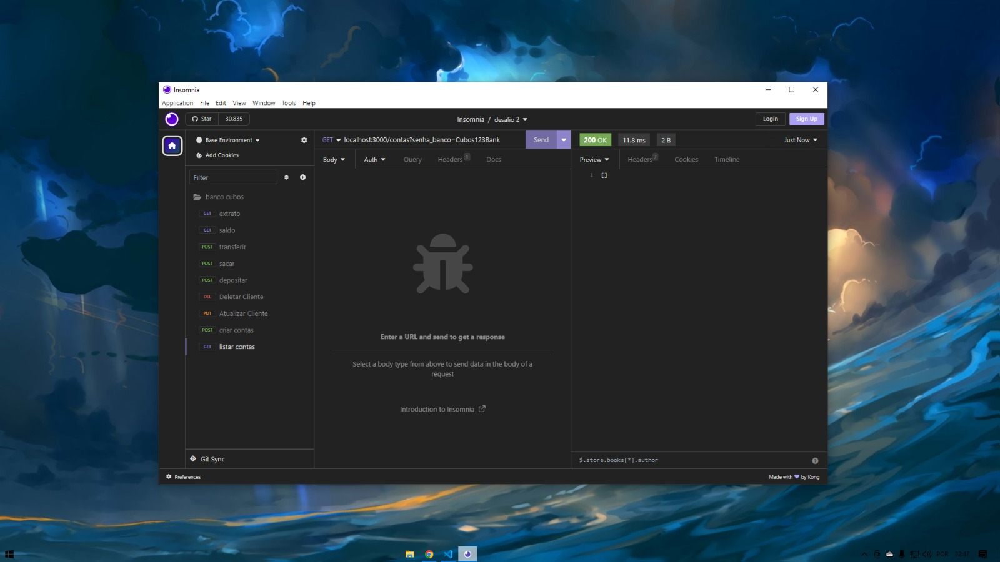

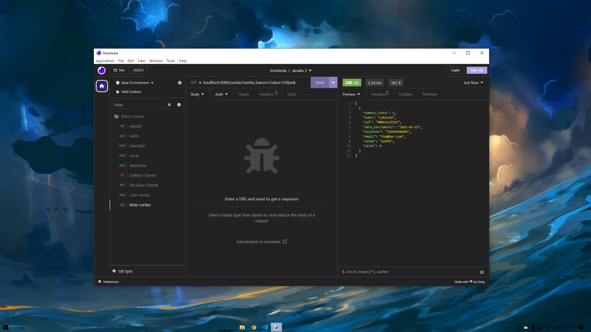

Ainda no end-póint de "Criar Contas" existem algumas validações a serem mostradas, caso seu CPF seja identico a um usuário que já existe ele irá mostrar uma mensagem de erro. O mesmo acontece se seu e-mail for igual.

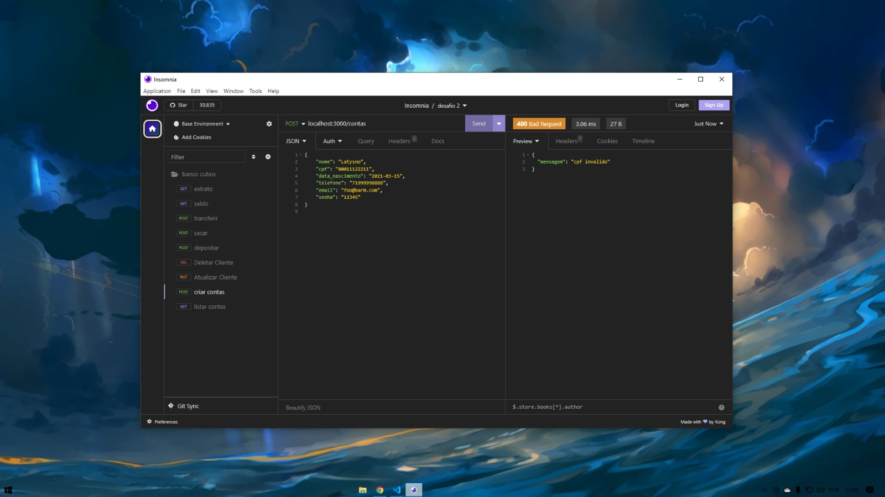

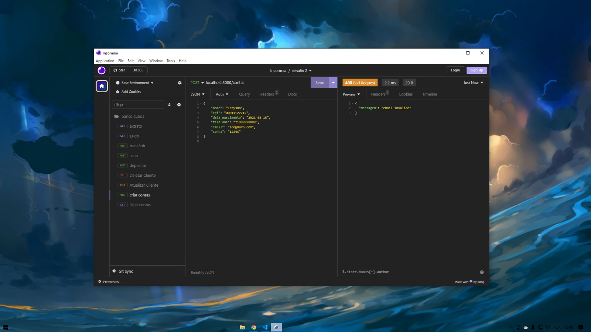

Já no end-point de "Atualizar Cliente" ele atualiza aquele cliente que você chamar no params validando se ele existe ou não, caso aquele id de cliente seja inválido ele irá mostrar uma mensagem de erro.

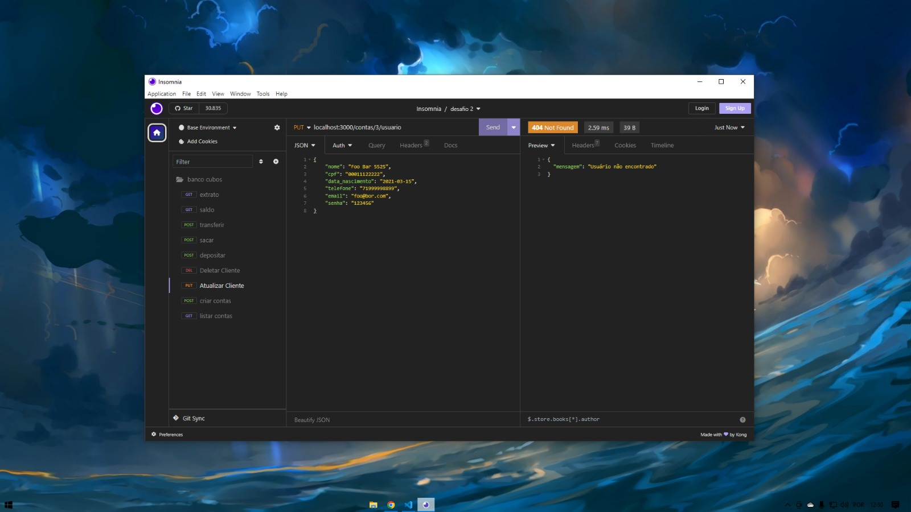

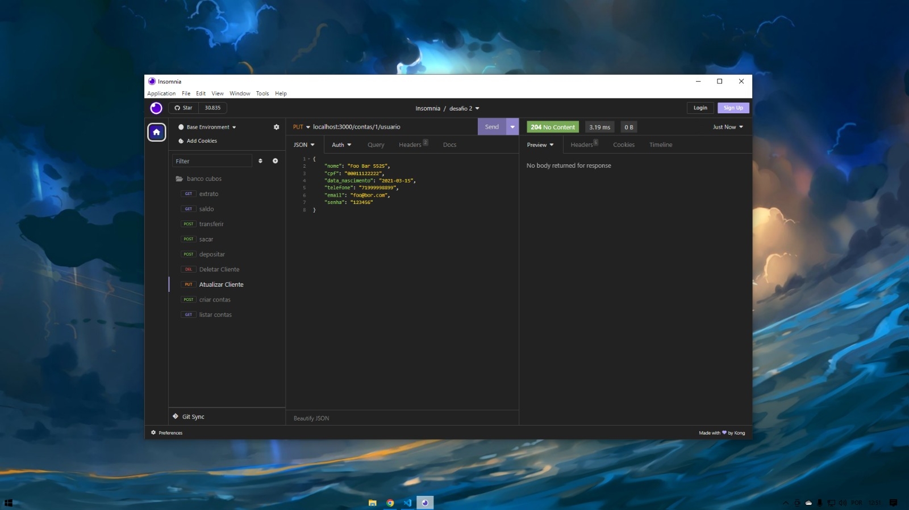

O end-point de "Deletar Cliente" faz as mesmas validações que o de atualização ele irá varrer para ver se existem aquele id que vc quer excluir a conta caso exista ele irá excluir a conta.

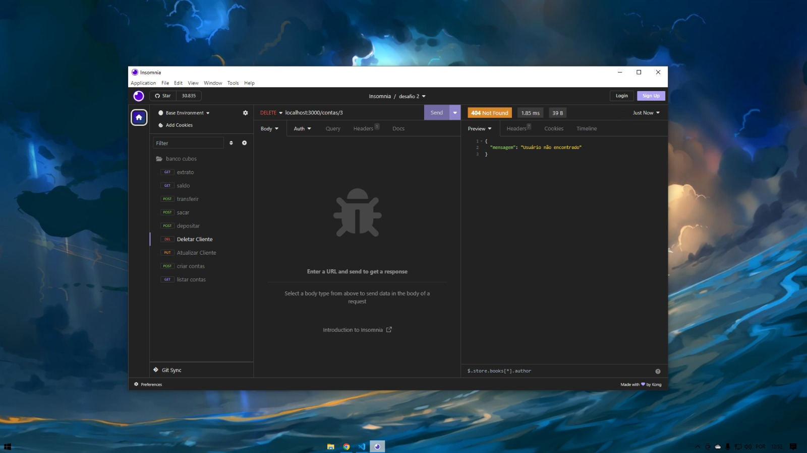

No end-point de "Depositar" existe apenas uma validação que é para ver se o usuário existe caso ele exista ele faz o deposito no valor informado (em centavos).

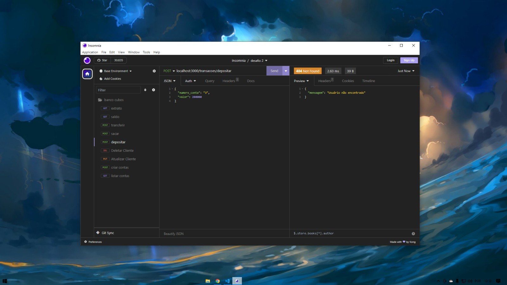
Assim que o deposito é efetuado ele mostra em que ano, mês , dia , hora , minutos e segundos daquela transação para caso ele queira ver futuramente saber quando ele fez.

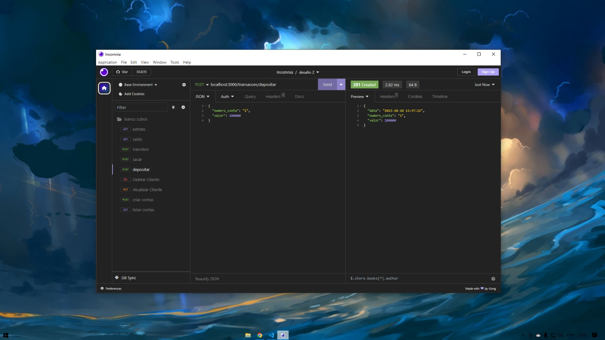

No end-point de "Saque" ele valida se o usuário existe e se o valor informado consta no saldo dessa conta, caso não conste ele diz que o saldo é insuficiente além dessas validações o usuário tem que difitar a senha cadastrada na criação da conta para poder efetuar o saque caso não digite corretamente o saque não é efetuado.

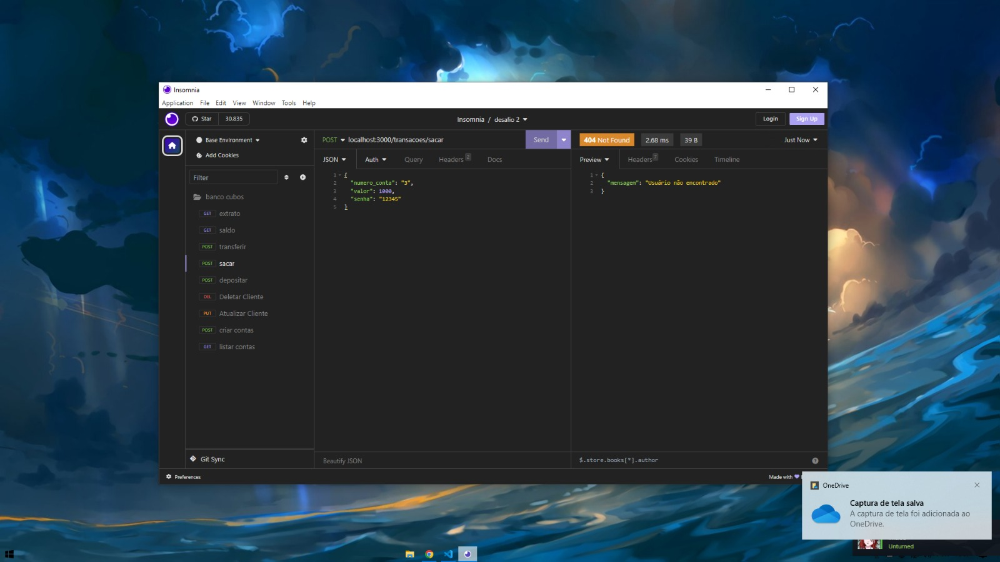

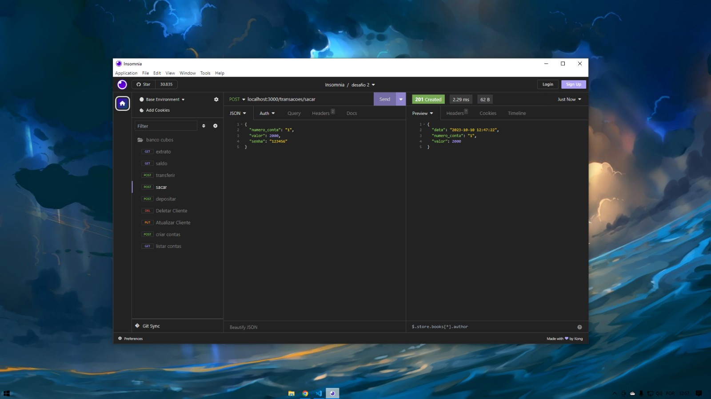

No end-point de "Transferir" ele busca dois ids o primeiro ele busca o da conta origem (a conta que irá efetuar a transferência) e o segundo id é a conta destino (a conta que irá receber a transferência) verificando a senha da conta origem caso a senha esteja incorreta a transferência não é efetuada e caso um dos ids não exista a transfereência não é efetuada também.

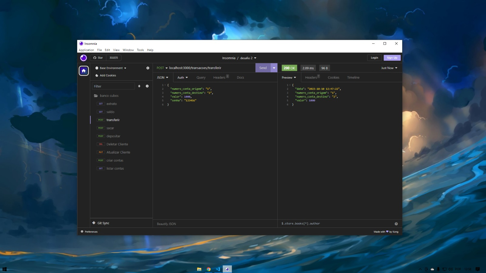

No end-point de "Saldo" ele mostra o saldo da conta informada no params caso ela exista e se sua senha estiver correta.

Aqui vemos que tanto o depósito, saque e a transferencia foram feitas com sucesso.

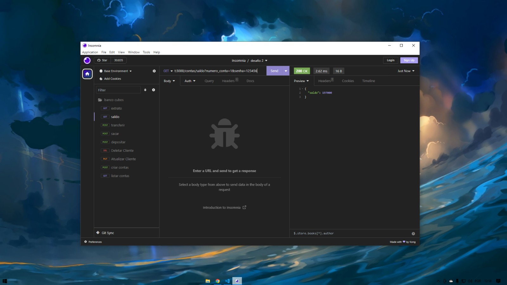

E no end-point de "Extrato" irá mostrar todas as transações feitas naquela conta, caso o usuário tenha alguma dúvida. Além disso mostra a data em que todas elas foram realizadas,mas para ter acesso ao extrato a conta tem que existir e a senha tem que estar correta.

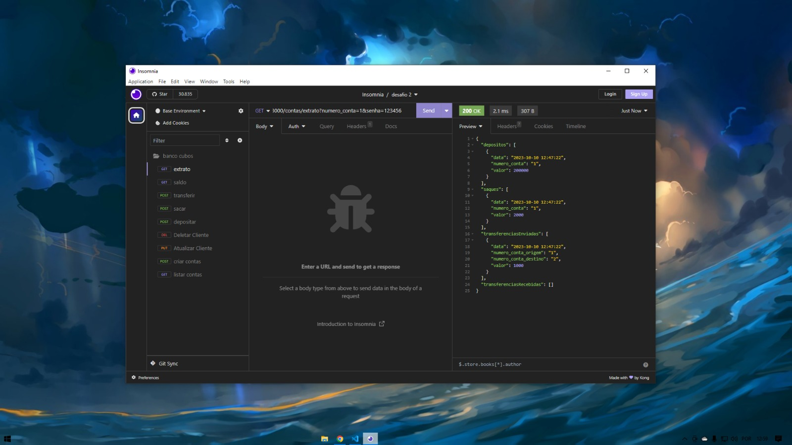
